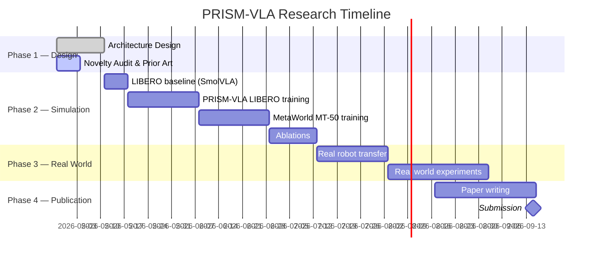

# 🧠 VLA Research Hub

> [!important] Mission Statement
> Design, validate, and publish **PRISM-VLA** — a sub-500M parameter Visual Language Action model that achieves **≥99% on LIBERO** and **≥80% on MetaWorld MT-50** through a fundamentally novel *Predictive Residual Input Sparse Modulation* architecture. This is PhD-level original science, fully claimable, and real-world deployable.

---

## 🗺️ The Research Map

```mermaid
graph TD
    A["🏠 VLA Research Hub"] --> B["🔬 Research Foundations"]
    A --> C["🏗️ Novel Architecture\n(PRISM-VLA)"]
    A --> D["📊 Benchmarks"]
    A --> E["📚 Literature Review"]
    A --> F["🧪 Experiments"]
    A --> G["🤖 Real World Deployment"]
    A --> H["📝 Paper Draft"]

    B --> B1["Problem Space"]
    B --> B2["Why VLAs Fail"]
    B --> B3["Key Insight"]

    C --> C1["PRISM Architecture"]
    C --> C2["DVE Module"]
    C --> C3["PACE Module"]
    C --> C4["EAS Module"]
    C --> C5["Parameter Budget"]

    D --> D1["LIBERO Suite"]
    D --> D2["MetaWorld MT-50"]
    D --> D3["LIBERO-PRO"]

    E --> E1["SmolVLA"]
    E --> E2["pi0 / pi0.5"]
    E --> E3["OpenVLA"]
    E --> E4["RoboVLMs"]
    E --> E5["Mamba Policy"]

    F --> F1["Ablation Plan"]
    F --> F2["Experiment Log"]
    F --> F3["Baseline Results"]

    G --> G1["Real Robot Setup"]
    G --> G2["Deployment Protocol"]
```



---

## 📁 Vault Structure

| Folder | Purpose |
|---|---|
| [[VLA Research Hub]] | You are here — master MOC |
| `01 - Research Foundations` | The "why" — problems, gaps, key insight |
| `02 - Novel Architecture` | PRISM-VLA design documents |
| `03 - Benchmarks` | LIBERO, MetaWorld, LIBERO-PRO specs |
| `04 - Literature Review` | Annotated papers |
| `05 - Experiments` | Ablations, logs, results |
| `06 - Real World Deployment` | Robot setup, deployment notes |
| `07 - Paper Draft` | LaTeX-ready sections |
| `08 - Daily Log` | Daily research journal |
| `09 - Resources` | Datasets, codebases, links |
| `10 - Code & Implementation` | Architecture pseudocode, configs |

---

## 🎯 Project North Stars

- [ ] **LIBERO Suite**: ≥99% mean success across all 4 suites
- [ ] **LIBERO-PRO**: ≥80% (robustness target — generalization, not memorization)
- [ ] **MetaWorld MT-50**: ≥80% mean success rate
- [ ] **Parameter count**: < 500M total
- [ ] **Inference speed**: ≥10Hz on single A100 (real-robot deployable)
- [ ] **Novelty**: ≥3 novel technical contributions, all prior-art-checked
- [ ] **Publication**: NeurIPS / ICLR / ICRA ready

---

## 🔥 The Core Novel Idea (In One Sentence)

> **PRISM-VLA** exploits the *temporal redundancy* of visual observations in robotic manipulation — encoding only what *changed* and *why it matters* — to free the model's full capacity for action generation, achieving superior performance at a fraction of the compute.

→ [[PRISM-VLA Architecture Overview]]
→ [[The Core Scientific Insight]]
→ [[Novelty Claims & Prior Art Check]]

---

## Council Review

> Multi-note synthesis of the vault's current research debate: PRISM vs. STRATOS vs. PROGRESS vs. GAUSS.

### What changed in the second brain

- The vault no longer contains just one confident architecture story.
- It now records a sequence of self-corrections:
  `PRISM-VLA` → `Brutal Critique` → `STRATOS/PROGRESS debate` → `GAUSS-VLA thesis`
- That is a good sign. The research direction is becoming more falsifiable and less attached to the first idea.

### Council of experts: verdict by approach

| Voice | Best current judgment |
|---|---|
| **Novelty reviewer** | `PRISM-VLA` is not the strongest claim anymore; too much of DVE is scooped, and only part of EAS remains clearly novel. |
| **Benchmark skeptic** | Standard `LIBERO` is not a headline metric; `LIBERO-PRO`, `LIBERO-Long`, and rotation-heavy `MT-50` subsets are more defensible. |
| **Theory person** | `GAUSS-VLA` has the deepest technical thesis because it attacks the geometry problem directly on `SE(3)` instead of layering heuristics on top of Euclidean action space. |
| **Ablation pragmatist** | `PROGRESS-VLA` is the cleanest intermediate experiment because it tests whether discrete phases are even needed before paying STRATOS complexity. |
| **Systems engineer** | `autoresearch` is best used as the research-operations layer around these experiments, not as the source of the scientific idea. |

### Who has the best approach

**Best overall research thesis:** `GAUSS-VLA`

Why:
- It absorbs the strongest surviving intuition from earlier notes: action space has structure.
- It replaces a weak abstraction with a stronger one: not eigenspaces or phases first, but geometry on `SE(3)` plus calibrated uncertainty.
- It creates clearer publication-level claims than PRISM or STRATOS:
  geometry-aware action generation, uncertainty calibration, and adaptive replanning horizon.
- It aligns better with the hardest tasks in the vault: long-horizon control, rotation-heavy manipulation, and deployment credibility.

**Best next experimental decision rule:** `PROGRESS-first, STRATOS only if needed`

Why:
- The debate note argues that `PROGRESS-VLA` is the simplest architecture that still tests the core phase assumption.
- If a simpler progress-conditioned model works, STRATOS complexity is unnecessary.
- If even the null architecture works, both PROGRESS and STRATOS are over-engineered and the paper should pivot toward geometry / deployment instead.

### Ranked recommendation

1. `GAUSS-VLA` as the thesis and paper direction.
2. `PROGRESS-VLA` as the best control experiment if the phase question still matters.
3. `STRATOS-VLA` only if phase consistency is empirically validated and simpler alternatives leave performance on the table.
4. `PRISM-VLA` as historical scaffolding, not the final claim.

### Why PRISM is no longer the winner

- `DVE` was challenged as scooped by later literature and critique notes.
- `PACE` depends on a phase story that the debate note says is still unproven.
- `EAS` preserved the intuition that action structure matters, but the vault later argues the correct structure is geometric, not PCA-style linear decomposition.
- The original headline package also carries benchmark and parameter-counting problems that weaken the paper narrative.

### What the council would do next

1. Update the public-facing story of the vault so `PRISM-VLA` is no longer treated as the uncontested active thesis.
2. Keep `autoresearch` attached to `GAUSS-VLA` and the benchmark program as a loop engine for:
   hypothesis ranking, scenario generation, metric plumbing, ablation bookkeeping, and paper-readiness checks.
3. Run the highest-leverage reality checks before any more architecture mythology:
   SmolVLA MT-50 baseline, fair parameter accounting, and a null / simpler control on long-horizon tasks.

### Bottom line

The best approach in the current second brain is **not** the original PRISM stack. The strongest research posture is:

`GAUSS-VLA` for the thesis  
`PROGRESS-VLA` for the clean control experiment  
`autoresearch` for disciplined research operations

---

## Autoresearch Integration

> Source: [uditgoenka/autoresearch](https://github.com/uditgoenka/autoresearch)
> Working translation for this vault: use autonomous loops only where the success signal is mechanical, bounded, and repeatable.

### Why it matters for PRISM-VLA

- The repo's core pattern is: one goal, one metric, one focused change, one verification loop.
- That fits this project well because the main targets are measurable: LIBERO success, MetaWorld success, parameter count, and inference speed.
- The caution is equally important: do not use autoresearch for vague scientific judgment. Use it for measurable subproblems, then do human review for theory and claim framing.

### What this project actually contributes

- A **setup gate**: the method refuses to loop until goal, scope, metric, and verify steps are explicit.
- A **disciplined iteration protocol**: one change per iteration, mechanical verification, automatic rollback, and experiment logging.
- A **family of chainable modes**, not just one loop: `plan`, `predict`, `scenario`, `reason`, `learn`, and `ship`.
- A **noise-aware mindset**: the project explicitly treats unstable metrics as first-class and recommends repeated measurement plus minimum deltas.
- A **research-journal model of git**: commit history is not bookkeeping; it is the memory that keeps the next experiment honest.

### What transfers cleanly, and what does not

| Transfers well to PRISM-VLA | Needs human control |
|---|---|
| Bounded ablations with one metric | Grand theory formation |
| Benchmark-specific improvement loops | Novelty claims at publication level |
| Failure-mode enumeration | Interpreting surprising scientific results |
| Readiness checklists for papers | Deciding whether a result is genuinely important |
| Hypothesis ranking before expensive runs | Choosing the long-term research agenda |

The useful framing here is: `autoresearch` is best as a research operations engine, not as a substitute for scientific taste.

### What this means for the project architecture

- `PRISM-VLA` should expose **machine-readable metrics** before we trust any loop.
- The benchmark pipeline needs a **fast proxy verify path** for early iterations and a **full verify path** for serious decisions.
- The vault should separate **objective loops** from **subjective review**:
  objective = benchmark score, params, throughput, compliance
  subjective = novelty, framing, claim strength, paper story
- Expensive full training runs should be preceded by cheaper upstream stages:
  `reason` for claims, `predict` for likely failure causes, `scenario` for blind spots, then bounded `autoresearch` loops.

### Best-fit uses in this research program

| Autoresearch command | Best use in this vault | Desired output |
|---|---|---|
| `$autoresearch plan` | Turn vague goals into bounded research loops | metric, scope, verify command |
| `$autoresearch` | Run architecture or training ablations with one change per iteration | keep/revert experiment history |
| `$autoresearch predict` | Generate ranked hypotheses before burning training time | prioritized failure / opportunity list |
| `$autoresearch scenario` | Enumerate failure modes for rollout, distractors, long-horizon control, and dataset shift | edge-case matrix |
| `$autoresearch reason` | Adversarially stress-test novelty claims and paper arguments | stronger claim set with weak points exposed |
| `$autoresearch ship --type research` | Pre-submission paper checklist | submission readiness report |

### VLA-specific metrics worth operationalizing

- `LIBERO mean success %`
- `MetaWorld MT-50 mean success %`
- `params_millions`
- `sim_inference_hz` or `real_robot_hz`
- `ablation_delta_vs_baseline`
- `PRISMA compliance %` for literature review structure
- `claim_evidence_coverage %` for novelty audit completeness

### Project gaps before this becomes real

- A `Verify:` layer that outputs one parsable number for each benchmark target.
- A stable **mini-benchmark** or proxy evaluation for cheap iteration before full LIBERO / MetaWorld sweeps.
- A reproducible **results ledger** that stores config, seed, metric, date, and kept/reverted status.
- A claim-audit template that links each novelty sentence to evidence, comparisons, and prior-art notes.
- A guardrail for parameter budget and inference speed so score gains do not quietly destroy deployability.

### Suggested command patterns

```text
$autoresearch plan
Goal: Raise LIBERO mean success above SmolVLA baseline without exceeding 500M params
```

```text
$autoresearch
Iterations: 15
Goal: Improve LIBERO mean success for PRISM-VLA
Scope: 02 - Novel Architecture/**, 05 - Experiments/**, 10 - Code & Implementation/**
Metric: LIBERO mean success % (higher is better)
Verify: run_libero_eval_and_extract_metric
Guard: check_params_under_500m && check_inference_hz
```

```text
$autoresearch predict --chain debug
Goal: Identify the most likely causes of weak long-horizon manipulation performance
Scope: training configs, architecture notes, baseline results, failure analysis notes
```

```text
$autoresearch scenario --depth deep --focus edge-cases
Scenario: PRISM-VLA succeeds on short-horizon tasks but degrades under distractors, viewpoint shift, and long-horizon sequencing
Domain: software
```

```text
$autoresearch reason --domain research
Task: Stress-test the claim that differential visual encoding is genuinely novel relative to SmolVLA, OpenVLA, pi0/pi0.5, and Mamba-style sequence models
```

```text
$autoresearch ship --type research
Target: 07 - Paper Draft/
```

### Recommended project workflow

1. Use `$autoresearch reason --domain research` on every major novelty claim before it enters the paper draft.
2. Use `$autoresearch predict` before expensive training blocks to rank likely causes of weak results or hidden bottlenecks.
3. Use `$autoresearch scenario` on benchmark and deployment settings to surface distractor, temporal, recovery, and distribution-shift failures.
4. Use `$autoresearch plan` to turn each ablation family into a metric-driven loop with an explicit verify command.
5. Use bounded `$autoresearch` runs only after the baseline is reproducible and the metric extractor is trusted.
6. Use `$autoresearch ship --type research` before submission to force a checklist over citations, methodology, figures, and claim support.

### Practical rules for this vault

- Keep loops narrow: one benchmark, one module, one ablation family at a time.
- Prefer fast verify commands. If a loop takes hours, use autoresearch to plan and rank experiments first, not to brute-force everything.
- Treat `git log` as the experiment journal: every kept and reverted ablation should teach the next move.
- Use `$autoresearch reason` for novelty and paper argument quality, because those are partly subjective.
- Use `$autoresearch` only after the metric extractor is trustworthy and the baseline run is reproducible.
- For robotics, assume raw training metrics are noisy unless proven otherwise; design for repeated measurements and minimum meaningful deltas.

---

## 📅 Research Timeline



---

## 🧭 Quick Navigation

- [[The Core Scientific Insight]] ← **Start here**
- [[PRISM-VLA Architecture Overview]] ← The full system
- [[Differential Visual Encoding (DVE)]] ← Novel module 1
- [[Phase-Aware Cross-Entropy (PACE)]] ← Novel module 2
- [[Eigenspace Action Synthesis (EAS)]] ← Novel module 3
- [[LIBERO Benchmark Strategy]] ← How to hit 99%
- [[MetaWorld MT-50 Strategy]] ← How to hit 80%
- [[Novelty Claims & Prior Art Check]] ← Claim your IP
- [[Experiment Log]] ← Live results
- [[Paper Outline]] ← Publication path
