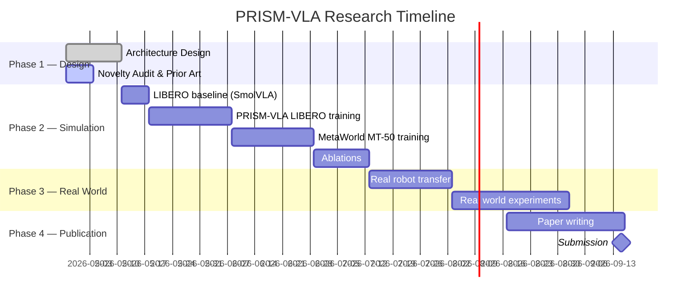

# 🧠 VLA Research Hub

> [!important] Mission Statement
> Design, validate, and publish **PRISM-VLA** — a sub-500M parameter Visual Language Action model that achieves **≥99% on LIBERO** and **≥80% on MetaWorld MT-50** through a fundamentally novel *Predictive Residual Input Sparse Modulation* architecture. This is PhD-level original science, fully claimable, and real-world deployable.

---

## 🗺️ The Research Map

```mermaid
graph TD
    A["🏠 VLA Research Hub"] --> B["🔬 Research Foundations"]
    A --> C["🏗️ Novel Architecture\n(PRISM-VLA)"]
    A --> D["📊 Benchmarks"]
    A --> E["📚 Literature Review"]
    A --> F["🧪 Experiments"]
    A --> G["🤖 Real World Deployment"]
    A --> H["📝 Paper Draft"]

    B --> B1["Problem Space"]
    B --> B2["Why VLAs Fail"]
    B --> B3["Key Insight"]

    C --> C1["PRISM Architecture"]
    C --> C2["DVE Module"]
    C --> C3["PACE Module"]
    C --> C4["EAS Module"]
    C --> C5["Parameter Budget"]

    D --> D1["LIBERO Suite"]
    D --> D2["MetaWorld MT-50"]
    D --> D3["LIBERO-PRO"]

    E --> E1["SmolVLA"]
    E --> E2["pi0 / pi0.5"]
    E --> E3["OpenVLA"]
    E --> E4["RoboVLMs"]
    E --> E5["Mamba Policy"]

    F --> F1["Ablation Plan"]
    F --> F2["Experiment Log"]
    F --> F3["Baseline Results"]

    G --> G1["Real Robot Setup"]
    G --> G2["Deployment Protocol"]
```

---

## 📁 Vault Structure

| Folder | Purpose |
|---|---|
| [[VLA Research Hub]] | You are here — master MOC |
| `01 - Research Foundations` | The "why" — problems, gaps, key insight |
| `02 - Novel Architecture` | PRISM-VLA design documents |
| `03 - Benchmarks` | LIBERO, MetaWorld, LIBERO-PRO specs |
| `04 - Literature Review` | Annotated papers |
| `05 - Experiments` | Ablations, logs, results |
| `06 - Real World Deployment` | Robot setup, deployment notes |
| `07 - Paper Draft` | LaTeX-ready sections |
| `08 - Daily Log` | Daily research journal |
| `09 - Resources` | Datasets, codebases, links |
| `10 - Code & Implementation` | Architecture pseudocode, configs |

---

## 🎯 Project North Stars

- [ ] **LIBERO Suite**: ≥99% mean success across all 4 suites
- [ ] **LIBERO-PRO**: ≥80% (robustness target — generalization, not memorization)
- [ ] **MetaWorld MT-50**: ≥80% mean success rate
- [ ] **Parameter count**: < 500M total
- [ ] **Inference speed**: ≥10Hz on single A100 (real-robot deployable)
- [ ] **Novelty**: ≥3 novel technical contributions, all prior-art-checked
- [ ] **Publication**: NeurIPS / ICLR / ICRA ready

---

## 🔥 The Core Novel Idea (In One Sentence)

> **PRISM-VLA** exploits the *temporal redundancy* of visual observations in robotic manipulation — encoding only what *changed* and *why it matters* — to free the model's full capacity for action generation, achieving superior performance at a fraction of the compute.

→ [[PRISM-VLA Architecture Overview]]
→ [[The Core Scientific Insight]]
→ [[Novelty Claims & Prior Art Check]]

---

## 📅 Research Timeline

---

## 🧭 Quick Navigation

- [[The Core Scientific Insight]] ← **Start here**
- [[PRISM-VLA Architecture Overview]] ← The full system
- [[Differential Visual Encoding (DVE)]] ← Novel module 1
- [[Phase-Aware Cross-Entropy (PACE)]] ← Novel module 2
- [[Eigenspace Action Synthesis (EAS)]] ← Novel module 3
- [[LIBERO Benchmark Strategy]] ← How to hit 99%
- [[MetaWorld MT-50 Strategy]] ← How to hit 80%
- [[Novelty Claims & Prior Art Check]] ← Claim your IP
- [[Experiment Log]] ← Live results
- [[Paper Outline]] ← Publication path
