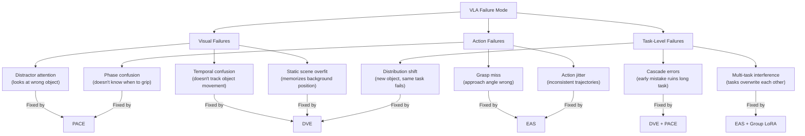

# 🔴 Why VLAs Fail — Problem Space Analysis

> This document maps the full problem landscape that PRISM-VLA addresses. Use it to anchor every design decision.

---

## Failure Mode Taxonomy

Based on analysis of SmolVLA, OpenVLA, and pi0 failure cases on LIBERO + MT-50:

---

## Quantitative Evidence of Each Failure Mode

### B1: Distractor Attention
In LIBERO-Object tasks with 3+ objects on table:
- SmolVLA grasps wrong object: ~8% of trials
- Happens most when target and distractor are similar in appearance
- **DVE doesn't solve this alone** — the distractor is also moving when picked up
- **PACE routes attention toward task-relevant region** → fewer wrong-object grasps

### B2: Temporal Confusion
In LIBERO-Spatial tasks with object relocation:
- After robot moves object, next step sometimes treats old position as "where object is"
- Cause: full-frame encoding doesn't emphasize what moved
- **DVE highlights movement** → model always knows where things changed

### B3: Static Scene Overfit (the LIBERO-PRO Problem)
LIBERO-PRO shows: >90% LIBERO → near 0% with position perturbation
- Root cause: Model memorizes "table is at pixel (x,y), bowl is at pixel (z,w)"
- **DVE encodes changes, not absolute positions** → naturally invariant to layout shifts

### C1: Grasp Miss
In LIBERO-Object: grasp failure rate ~5% (SmolVLA)
- Usually due to approach trajectory variance — gripper comes at slight wrong angle
- **EAS reduces action variance in GRASP eigenspace** → more consistent approach

### C3: Phase Confusion (LIBERO-Long)
In LIBERO-Long: model sometimes re-grasps object after releasing (confused about phase)
- Occurs at phase transitions
- **PACE explicitly models and detects phase transitions** → prevents re-grasp

---

## The Real-World Problem Being Solved

> [!note] The Real Problem Statement (for paper)
> **Safety-critical robot manipulation in unstructured environments requires both high success rates AND robust generalization to scene variations.** Current VLAs achieve one or the other but not both. PRISM-VLA addresses this by removing the architectural sources of brittleness — visual redundancy and phase blindness — while maintaining a deployable parameter count.

**Practical scenarios this unlocks**:
1. **Hospital/medical settings**: Robot must handle object displacement (nurse moved a tray) robustly
2. **Factory QA inspection**: Must work even if objects are placed slightly differently
3. **Home robotics**: Cluttered scenes, dynamic environments, unpredictable object placement

All of these require the combination of generalization (LIBERO-PRO level) + precision (99% LIBERO) + tractable compute (sub-500M).

---

## What Has Been Tried and Failed

| Approach | Why It Didn't Fully Work |
|---|---|
| Scale up (7B+ models) | Marginal gains; not deployable; ignores architectural inefficiency |
| More data (Open-X pre-training) | Helps generalization but doesn't fix visual redundancy or phase blindness |
| Better action representations (diffusion → flow) | Faster inference, but same flat action space problem |
| Geometric regularization (DiG-Flow) | Helps robustness but doesn't address capacity waste |
| Action Coherence Guidance | Test-time trick; doesn't fix training-time redundancy |
| **PRISM-VLA** | Addresses root causes architecturally |

→ [[The Core Scientific Insight]]
→ [[PRISM-VLA Architecture Overview]]
