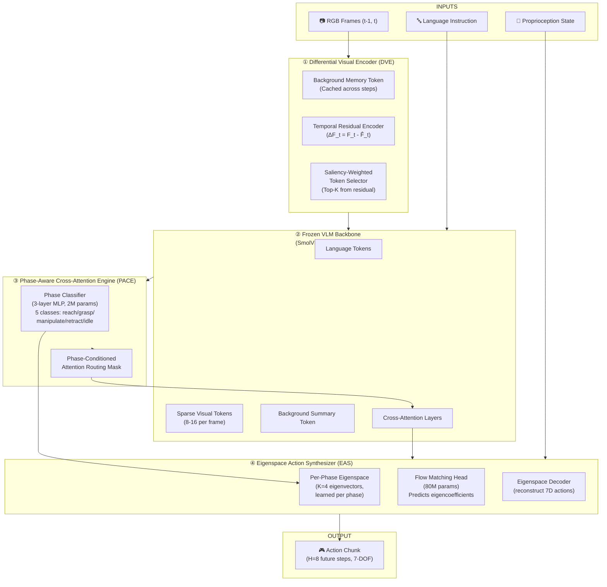

# 🏗️ PRISM-VLA Architecture Overview

**PRISM** = **P**redictive **R**esidual **I**nput **S**parse **M**odulation for Vision-Language-Action Models

---

## High-Level System Diagram

---

## Component Breakdown

### ① Differential Visual Encoder (DVE)

> [!note] Core Innovation #1
> Encodes only *what changed* between frames, not the full scene every step.

**Mechanism:**
1. At **t=0** (first frame of episode): Run full SigLIP encoder, compress to 64 tokens → store as **Background Memory Token** (BMT) — a 512-dim summary vector.
2. At **t>0**: 
   - Compute pixel-level temporal difference: `ΔI_t = I_t - I_{t-1}` 
   - Run lightweight ResNet-18 patch encoder on `ΔI_t` → 64 candidate residual tokens
   - Apply **Saliency-Weighted Top-K Selection**: keep only the **top-8 residual tokens** ranked by L2 magnitude + language cross-attention score
   - Concatenate: `[BMT, top-8 residual tokens]` → **9 total visual tokens** (vs. 64 in SmolVLA)

**Parameter cost**: ResNet-18 delta encoder ≈ 11M params (frozen after pretraining). Top-K selector ≈ 0.5M params.

**Why this works**: In manipulation tasks, only the gripper, target object, and contact region change meaningfully. The rest of the scene is static. DVE captures exactly this.

---

### ② VLM Backbone (Adapted SmolVLM-2)

**Base**: SmolVLM-2 first 16 layers ≈ 256M parameters. **Frozen** during task training (full fine-tune only at the end for LIBERO).

**Modifications**:
- Replace full frame tokens (64) with PRISM token stream: `[BMT | Residual-8 | Proprio-Embed]` = **10 tokens**
- Language tokens: up to 32 tokens (instruction is short)
- Total context per step: **~42 tokens** (vs. ~100+ in SmolVLA)

**Result**: 2.4x faster per-step forward pass. More importantly, **all attention layers now focus on a compact, information-rich context**.

---

### ③ Phase-Aware Cross-Attention Engine (PACE)

> [!note] Core Innovation #2
> Infers manipulation phase from the hidden state and dynamically routes attention.

**Mechanism:**
1. **Phase Classifier**: 3-layer MLP (2M params) takes the language hidden state + mean visual token at each step → outputs soft probability distribution over 5 phases:
   - `REACH` — moving toward target
   - `GRASP` — closing gripper on object
   - `MANIPULATE` — carrying / reorienting
   - `RETRACT` — releasing and withdrawing
   - `IDLE` — waiting / completed

2. **Phase-Conditioned Attention Mask**: Each phase has a learned **attention bias vector** (shared across layers). During cross-attention, we add the phase-weighted bias to the Q*K^T scores before softmax. This effectively:
   - During REACH: boosts attention to target object tokens
   - During GRASP: boosts attention to gripper-contact region tokens
   - During MANIPULATE: boosts attention to spatial relationship tokens (where to place)

**Parameter cost**: Phase classifier 2M + Attention bias vectors (5 phases × 8 residual tokens × 16 layers) ≈ 0.5M params. **Total: 2.5M params**

**Training**: Phase labels are **automatically derived** from proprioception trajectories (gripper state + velocity profile) — no manual annotation needed.

---

### ④ Eigenspace Action Synthesizer (EAS)

> [!note] Core Innovation #3
> Actions are predicted as coefficients in a learned, phase-specific low-dimensional manifold.

**Mechanism:**

1. **Offline Phase Decomposition** (done once on training data):
   - For each phase, collect all 7-DOF action vectors
   - Run PCA → keep top K=4 eigenvectors (capture >95% variance for manipulation)
   - Store as `E_phase ∈ R^{7×4}` — the phase eigenspace

2. **Online Action Synthesis** (at inference):
   - PACE outputs phase probabilities `p ∈ R^5`
   - Blend eigenspaces: `E_blend = Σ p_i * E_i`
   - Flow Matching head (80M params) predicts 4 eigencoefficients `c ∈ R^4`
   - Reconstruct action: `a = E_blend * c` → 7-DOF action

3. **Action Chunk**: Predict `H=8` future steps → output `8 × 7 = 56` values total (but in the 4D eigenspace, this is `8 × 4 = 32` values — 43% reduction in output dimensionality)

**Why this works**: 
- PCA of manipulation actions shows top-4 eigenvectors capture 93–97% of variance
- Predicting 4D instead of 7D reduces the flow matching head's task complexity significantly
- Phase blending enables smooth transitions between phases

---

## Full Parameter Budget

| Component | Parameters | Trainable? |
|---|---|---|
| DVE: Background Encoder (SigLIP-frozen) | 86M | ❌ Frozen |
| DVE: Delta Residual Encoder (ResNet-18) | 11M | ✅ Fine-tune |
| DVE: Saliency Top-K Selector | 0.5M | ✅ Train from scratch |
| VLM Backbone (SmolVLM-2, 16 layers) | 256M | ❌ Frozen → LoRA fine-tune |
| VLM LoRA adapters (r=16) | ~3M | ✅ Train |
| PACE: Phase Classifier | 2M | ✅ Train |
| PACE: Attention Bias Vectors | 0.5M | ✅ Train |
| EAS: Flow Matching Head | 80M | ✅ Train |
| EAS: Eigenspace Decoder | 0.1M | ✅ (fixed after init) |
| **Total** | **~439M** | **<500M ✅** |

---

## Design Choices & Trade-offs

| Decision | Rationale |
|---|---|
| Frozen backbone + LoRA | Preserves VLM priors, massively reduces training cost, prevents forgetting |
| K=8 residual tokens | Ablation target: K=4,8,16,32 — 8 balances compression vs. information |
| K=4 action eigenspace | PCA analysis on LIBERO demos shows 4 PCs explain >95% variance |
| H=8 action chunk horizon | Balances reactivity vs. smoothness. SmolVLA uses H=16 — we hypothesize H=8 + DVE reactivity > H=16 + full frame |
| Phase=5 classes | Covers all standard manipulation primitives. Extensible to 8 for real-world |
| Flow Matching (not diffusion) | 1-step inference capability, inspired by SmolVLA success |

---

## Key References

- [[SmolVLA Paper Notes]] — baseline we improve on
- [[Differential Visual Encoding (DVE)]] — detailed design
- [[Phase-Aware Cross-Entropy (PACE)]] — detailed design
- [[Eigenspace Action Synthesis (EAS)]] — detailed design
- [[Parameter Budget Analysis]] — exact count methodology
- [[PRISM-VLA Training Recipe]] — how to train this
