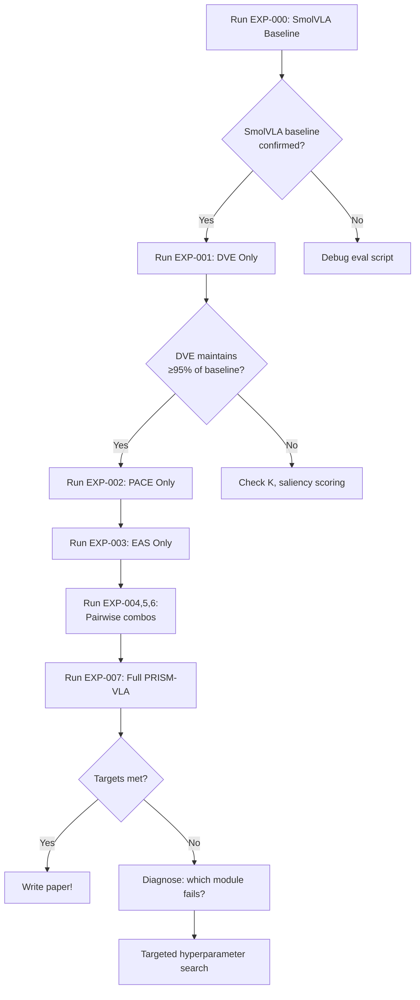

# 🧪 Experiment Log

> [!note] How to Use This Log
> Add a new entry for every experiment. Use the template below. Update the Summary Table at the top regularly.

---

## Summary Results Table (Live)

| Exp ID | Description | LIBERO Mean | MT-50 | Params | Status |
|---|---|---|---|---|---|
| EXP-000 | SmolVLA Baseline (repro) | TBD | TBD | 450M | ⏳ Pending |
| EXP-001 | DVE only (no PACE, no EAS) | TBD | TBD | ~380M | ⏳ Pending |
| EXP-002 | PACE only (no DVE, no EAS) | TBD | TBD | ~370M | ⏳ Pending |
| EXP-003 | EAS only (no DVE, no PACE) | TBD | TBD | ~380M | ⏳ Pending |
| EXP-004 | DVE + PACE (no EAS) | TBD | TBD | ~395M | ⏳ Pending |
| EXP-005 | DVE + EAS (no PACE) | TBD | TBD | ~400M | ⏳ Pending |
| EXP-006 | PACE + EAS (no DVE) | TBD | TBD | ~410M | ⏳ Pending |
| EXP-007 | **Full PRISM-VLA** | TBD | TBD | 439M | ⏳ Pending |
| EXP-008 | PRISM + LIBERO-PRO train | TBD | — | 439M | ⏳ Pending |

---

## EXP-000: SmolVLA Baseline Reproduction

**Date**: TBD  
**Purpose**: Establish the exact baseline we're beating. Reproduce SmolVLA on our hardware.  
**Status**: ⏳ Pending  

### Setup
```bash
# Clone SmolVLA
git clone https://github.com/huggingface/lerobot
cd lerobot
pip install -e ".[smolvla]"

# Download SmolVLA weights
huggingface-cli download lerobot/smolvla-base

# Run LIBERO evaluation
python scripts/eval_smolvla.py \
  --suite libero_spatial \
  --n_eval_episodes 20 \
  --save_results results/smolvla_libero_spatial.json
```

### Expected Results (from paper)
- LIBERO-Spatial: ~92%
- LIBERO-Long: ~79%
- MT-50: ~55–62% (estimated, not in paper)

### Actual Results (fill in)
- LIBERO-Spatial: ___
- LIBERO-Object: ___
- LIBERO-Goal: ___
- LIBERO-Long: ___
- MetaWorld MT-50: ___

### Notes
- ___ 

---

## EXP-001: DVE Module Ablation (Standalone)

**Date**: TBD  
**Purpose**: Verify DVE reduces tokens without hurting performance. Sanity check.  
**Status**: ⏳ Pending  
**Hypothesis**: DVE should maintain ≥95% of SmolVLA performance while reducing compute 3x.

### Architecture
- Backbone: SmolVLM-2 (frozen, 16 layers)
- Visual tokens: DVE (9 tokens vs. SmolVLA's 64)
- Action head: standard 7D flow matching (same as SmolVLA)
- PACE: ❌ OFF
- EAS: ❌ OFF

### Metrics to Track
- LIBERO mean success rate
- Tokens processed per step (should be 9 vs. 64)
- Inference time per step
- VRAM usage

### Results (fill in)
- LIBERO Mean: ___
- Tokens/step: ___
- Inference ms: ___
- VRAM: ___

---

## EXP-007: Full PRISM-VLA

**Date**: TBD  
**Purpose**: The full system — this is the paper result.  
**Status**: ⏳ Pending  

### Architecture
- DVE: ✅ ON (K=8 tokens)
- PACE: ✅ ON (5 phases)
- EAS: ✅ ON (K=4 eigencomponents)
- LoRA: r=16, all modules
- Task-grouped LoRA for MT-50: 5 groups

### Training Config
```yaml
# PRISM-VLA Full Training Config
model:
  backbone: smolvlm2-256M-16layers
  dve:
    K: 8
    delta_encoder: resnet18-11M
    bmt_dim: 512
  pace:
    n_phases: 5
    bias_dim: [42, 9]
    classifier_hidden: [256, 128]
  eas:
    n_eigencomponents: 4
    action_horizon: 8
    flow_head_dim: 256
    flow_head_layers: 6
  lora:
    rank: 16
    alpha: 32
    target_modules: [q_proj, v_proj, out_proj]

training:
  libero:
    batch_size: 64
    steps_phase3: 100000
    steps_phase4: 30000
    lr_action_head: 1.0e-4
    lr_dve: 1.0e-5
    lr_lora: 5.0e-5
  mt50:
    batch_size: 64
    steps: 200000
    lr: 1.0e-4
    stratified_sampling: true

loss:
  lambda_phase: 0.1
  lambda_task_type: 0.05
```

### Target Results
- LIBERO-Spatial: ≥99%
- LIBERO-Object: ≥99%
- LIBERO-Goal: ≥99%
- LIBERO-Long: ≥99%
- MetaWorld MT-50: ≥80%
- Total params: 439M

### Actual Results (fill in)
| Benchmark | Target | Actual | Gap |
|---|---|---|---|
| LIBERO-Spatial | ≥99% | ___ | ___ |
| LIBERO-Object | ≥99% | ___ | ___ |
| LIBERO-Goal | ≥99% | ___ | ___ |
| LIBERO-Long | ≥99% | ___ | ___ |
| MetaWorld MT-50 | ≥80% | ___ | ___ |
| Params | <500M | 439M | ✅ |

---

## Ablation Decision Tree


